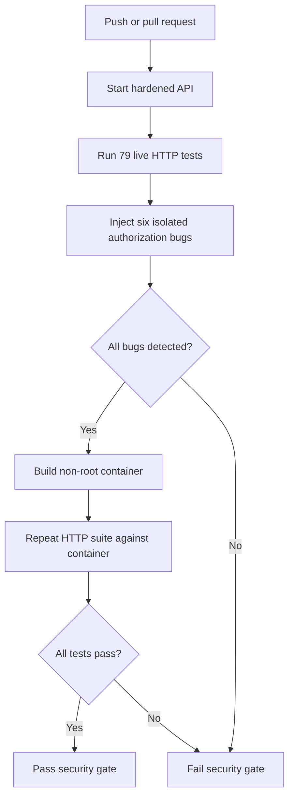

# API Authorization Testing Pipeline

[](https://github.com/ALVINNNNN/API-authorization-testing-pipeline/actions/workflows/authorization.yml)

**Prove that users can access what they should—and cannot access what they shouldn't.**

A synthetic banking API with two tenants, three roles, live HTTP authorization tests,
and a GitHub Actions security gate. The pipeline also introduces six controlled
authorization bugs into temporary copies and requires the tests to detect them.

No cloud account, API key, PAT, paid scanner, or third-party Python package is needed.
Python's standard library provides the demo API and test runner. The tests use
`unittest` with JUnit XML output rather than requiring pytest.

## End-to-end workflow



The source tests run on Python 3.12 and 3.13. The container runs Python 3.13,
uses an immutable base-image digest, and binds only to the runner's loopback
interface. It is removed after the tests; this workflow does not host a public API.

## What is tested

| Area | Examples |
|---|---|
| Object authorization / BOLA | Alice cannot access Bob's account or transactions, including direct transaction IDs |
| Tenant isolation | Acme admins and support users cannot access Beta customer resources |
| Function authorization | Customers and support users cannot call admin endpoints |
| Property authorization | Profile updates reject `role`, `tenant`, `id`, `password` and `balance`; rejected writes leave state unchanged |
| Response filtering | Support can read account metadata but cannot see balances or transactions |
| Authentication | Missing, invalid, tampered and expired bearer sessions return 401 |
| Logout | The logged-out session stops working while another session stays valid |
| Role changes | Only tenant admins can change customer/support roles; existing sessions use the new role immediately |
| Client-controlled claims | Spoofed identity headers and account-filter query parameters cannot expand access |
| Positive controls | Authorized reads, profile edits, role changes and tenant-scoped lists succeed |

The 79 test methods include 63 matrix-generated object-access cases plus 16
scenario tests, several with additional subcases. Assertions check response bodies
and state changes as well as HTTP status codes. This is targeted dynamic API
security testing, not a claim of complete vulnerability-scanner coverage.

## Permission model

| Operation | Customer | Support | Tenant admin |
|---|---|---|---|
| Read account | Own account | Same-tenant metadata, no balance | Any same-tenant account |
| Read transactions | Own account | Denied | Any same-tenant account |
| List accounts | Own only | Same-tenant metadata | Same tenant only |
| Edit display name | Self only | Self only | Self only |
| List users | Denied | Denied | Same tenant only |
| Change customer/support role | Denied | Denied | Same-tenant non-admin users only |
| Grant admin or modify another admin | Denied | Denied | Denied |
| Access another tenant | Denied | Denied | Denied |

Out-of-scope objects return 404 to avoid confirming that another user's resource
exists. A forbidden action on a visible resource returns 403. Missing or invalid
authentication returns 401. See [the test matrix](tests/read_matrix.json) and
[the endpoint guide](docs/API.md).

## Run it

### GitHub Actions

1. Open **Actions → API Authorization Security Gate → Run workflow → main**.
2. Inspect both Python test jobs, the container job, and the final **Security gate**.
3. Read the job summaries and download the evidence artifacts.
4. Make **Security gate** a required status check in your branch rules if you want
   GitHub to prevent merging a failing PR. The workflow itself does not configure branch protection.

Pushes to main and pull requests also trigger the workflow. Jobs have read-only
repository permissions, do not publish images, and do not use repository secrets.

### Local: one command

With Python 3.12 or 3.13 installed:

```bash
python scripts/run_pipeline.py
```

This starts and stops every API instance, generates temporary credentials, runs
the full suite and all six mutation checks, and writes `evidence/`. No Docker is
needed for this local source test. Use a fresh output directory for another run:

```bash
python scripts/run_pipeline.py --output evidence-second-run
```

### Explore the API manually

In Bash, from the repository root:

```bash
export DEMO_PASSWORD="$(python -c 'import secrets; print(secrets.token_urlsafe(32))')"
python -m app.server
```

Keep that password in your local environment for API requests. Log in using one of
the synthetic usernames in [docs/API.md](docs/API.md). The default session lifetime
is 900 seconds. Tests deliberately use three seconds to exercise expiry quickly.
The server refuses to start without a password of at least 16 characters.

## Prove the tests work

The hardened application contains no switch that disables authorization. The
runner copies `app/` into a temporary directory, changes one control, starts that
copy on loopback, and runs a named regression test against it.

| Seeded regression | Required detector |
|---|---|
| Remove account ownership check | Customer accesses another customer's account |
| Remove tenant boundary | Acme admin accesses a Beta account |
| Remove admin role guard | Customer calls the admin user-list endpoint |
| Remove profile field allowlist | Customer submits a privileged profile property |
| Stop revoking sessions at logout | Logged-out token is reused |
| Stop checking session expiry | Expired token is reused |

A mutation counts as detected only when its named test fails an assertion on an
unexpected HTTP 200 at the target endpoint. Test errors, startup failures, missing
reports and undetected mutations fail the pipeline. A green mutation check means
**the deliberately broken copy was caught**; it does not mean the broken API passed.
Mutated files are discarded and never included in the container image.

## Evidence

| File | Purpose |
|---|---|
| `summary.md` | Readable results shown in GitHub's job summary |
| `summary.json` | Machine-readable gate decision and source commit |
| `report.html` | Standalone report to open after downloading the artifact |
| `<check>/results.json` | Test results and redacted HTTP requests/responses |
| `<check>/junit.xml` | JUnit-compatible test results |
| `<check>/tests.log` | Actual test-runner CLI output |
| `<check>/server.log` | Startup diagnostics without request credentials |
| `image-id.txt` | Container image ID for the container test job |

Passwords and bearer tokens are redacted from structured evidence. The API does
not log request headers or bodies. CI credentials are randomly generated for each
run. Artifacts are retained for 14 days; all business data is synthetic.

## Design and limits

- Opaque random bearer tokens are stored server-side with expiration and revocation.
  Roles and tenants come from server-side user records, never client headers.
- The demo uses in-memory state and one shared, randomly supplied password for the
  synthetic users. Restarting resets all data and sessions.
- This is an authorization learning lab, not a production banking service. It does
  not implement a real identity provider, TLS termination, MFA, persistent storage,
  login throttling, transfers, refresh tokens or production audit logging.
- The standard-library HTTP server is intentionally small for code review and is
  not a production web server. Do not expose this lab publicly.
- Passing tests proves these scenarios for the tested commit. It does not prove
  absence of every authorization bug. Keep the permission matrix and regression
  cases current as endpoints change.

## Learning exercises

See [docs/LEARNING.md](docs/LEARNING.md) for reproducible regression exercises and
next steps, including authenticated DAST and OpenAPI-driven coverage.
